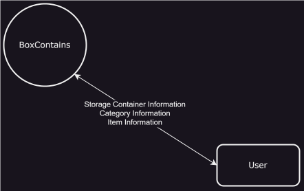

# Initial Requirements

## Project Scope
### Project Statement of Purpose
We need an application to track what items are in our storage boxes so that we can easily find the items where we are change home decorations or doing projects like hobbies or home repairs.

### Objective
| ID | Objective |
|:---:|:---|
|OBJ1| Have an easy to use tracking system for storage containers |
|OBJ2| For the tracking system to assist in organizing items|
|OBJ3| Have an easy to update tracking method |
|OBJ4| Be able to use the tracking system easily from our phone|
|OBJ5| Share our solution for others to use|

### Project Assumportions
| ID | Assumptions |
|:---:|:---|
|AS1|Initial version of the application will be contained within our secure home network with no outside access so will not require login or security.  This will be enhanced in later versions.|

### Project Constraints
| ID | Constraints|
|:---:|:---|
|CO1|Application can only be accessed from our home network|

### External Interactions
#### Context Level Dataflow Diagram

### High Level Processes
| ID | High Level Process |
|:---:|:---|
|HLP1|Track Storage Container|
|HLP2|Track Categories|
|HLP3|Track Items|
|HLP4|Track Items Location (which box it is in/belongs)|
|HLP5|Track if Items are in use (out of the designated box)|

### Glossary
| ID | Term | Definition |
|:---:|:---|:---|
|GL1|||